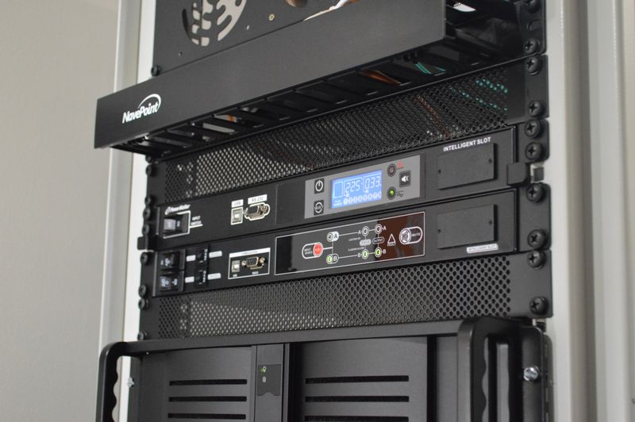

# About
There was no Linux software available for the PowerWalker PDU and ATS, but the [manufacturer](https://powerwalker.com/) was kind enough to supply me with what I needed to make my own library.



I'm using a Raspberry Pi as my power manager, it is connected to both the PDU and ATS. I'm planning to use MQTT to communicate with it, and report power usage etc. to things like Home Assistant. For graphing I'll be storing values in Elasticsearch and displaying the data using Kibana.

**Beta!** This library is still very much in beta, and not all features are implemented yet.

# PowerWalker PDU RC-16A IEC


PowerWalker PDU RC-16A is designed to distribute AC power from a single source to 8 outputs with advanced load monitoring and local or remote ON/OFF switching control of individual outlets.

https://powerwalker.com/?lang=en&page=product&item=10133001

## Available methods
| Method | Description |
| --- | --- |
| `connect()` | Connect to PDU device. |
| `send(cmd)` | Send custom command. |
| `info()` | Get and return device information. |
| `status()` | Get and return device statuses. (see codes below) |
| `power_watt()` | Get and return active power measurements for input and all outputs. |
| `power_va()` | Get and return apparent power measurements for input and all outputs. |
| `test()` | Test PDU device, turn on all LEDs and the buzzer for 5 seconds. |

> Changing output states not yet implemented.

### Output status codes
0. Off
1. On
2. Shutdown active
3. Shutdown imminent (S01-S08 code)
4. Restore active
5. Overload alarm (F01-F08 code)
6. Locked (L01-L08 code)

## Example responses

### `info()`
```
{   'in_out_phase': '1/1',
    'in_socket_no': '1',
    'model': '############PDU',
    'nom_ip_voltage': '230',
    'nom_op_voltage': '230',
    'out_socket_no': '8'}
```

### `status()`
```
{   'in_current': '02.1',
    'in_freq': '49.8',
    'in_voltage': '222.5',
    'out1_current': '00.0',
    'out2_current': '00.3',
    'out3_current': '00.5',
    'out4_current': '00.4',
    'out5_current': '00.1',
    'out6_current': '00.2',
    'out7_current': '00.2',
    'out8_current': '00.3',
    'status': {   'a01_low_in_voltage': '0',
                  'a02_high_in_voltage': '0',
                  'f09_low_in_current': '0',
                  'f10_high_in_current': '0',
                  'f11_pwr_fail_aux1': '0',
                  'f12_pwr_fail_aux2': '0',
                  'na_b8': '0',
                  'na_b9': '0',
                  'out1_status': '1',
                  'out2_status': '1',
                  'out3_status': '1',
                  'out4_status': '1',
                  'out5_status': '1',
                  'out6_status': '1',
                  'out7_status': '1',
                  'out8_status': '1'},
    'temp': '36.0'}
```

### `power_watt/va()`
```
{   'in_power': '0253',
    'out1_power': '0000',
    'out2_power': '0042',
    'out3_power': '0000',
    'out4_power': '0080',
    'out5_power': '0030',
    'out6_power': '0044',
    'out7_power': '0032',
    'out8_power': '0000'}
```

# PowerWalker ATS


ATS (Automatic Transfer Switch) supports connection of two independent power sources. If primary power source fails, the secondary will automatically back up the connected load without any interruption. 

https://powerwalker.com/?page=product&item=10120543&lang=en

## Available methods
| Method | Description |
| --- | --- |
| `connect()` | Connect to PDU device. |
| `send(cmd)` | Send custom command. |
| `info()` | Get and return device information. |
| `status()` | Get and return device statuses. |

> Changing perferred input not yet implemented.

## Example responses

### `info()`
```
{   'int_temp': '35.0',
    'out_current': '002.2',
    'out_load_pct': '013',
    'src1_freq': '50.0',
    'src1_voltage': '223.7',
    'src2_freq': '50.0',
    'src2_voltage': '223.7',
    'sync_angle': '001'}
```

### `status()`
```
{   'status': {   'aux_pwr1_fail': '0',
                  'aux_pwr2_fail': '0',
                  'na_c0': '0',
                  'na_c1': '0',
                  'na_c2': '0',
                  'na_c3': '0',
                  'na_c4': '0',
                  'na_c5': '0',
                  'na_c6': '0',
                  'na_c7': '0',
                  'on_fault_mode': '0',
                  'on_src1': '1',
                  'on_src2': '0',
                  'overload_alarm': '0',
                  'overload_fault': '0',
                  'short_fault': '0',
                  'src1_freq_bad': '0',
                  'src1_voltage_bad': '0',
                  'src1_wave_bad': '0',
                  'src2_freq_bad': '0',
                  'src2_preferred': '0',
                  'src2_voltage_bad': '0',
                  'src2_wave_bad': '0',
                  'syncron_bad': '0'}}
```

# Scripts
* `info.py`: Get and print device information.
* `mqtt.py`: Publishing values to a MQTT broker.
* `pdu_power.py`: Get real and apparent power from the PDU.
* `status.py`: Get and print statuses.
